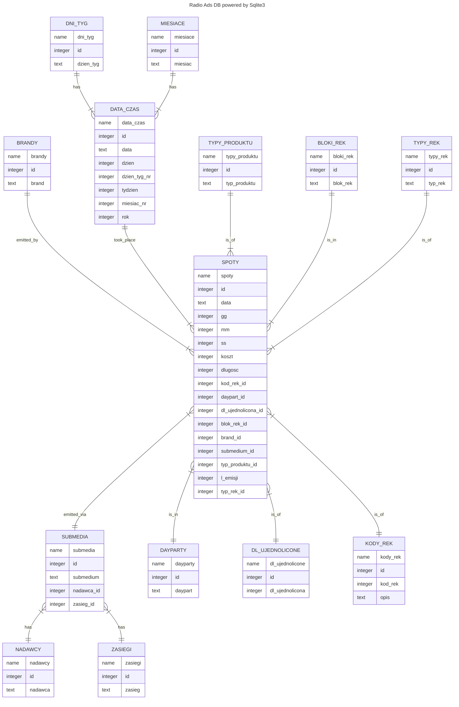
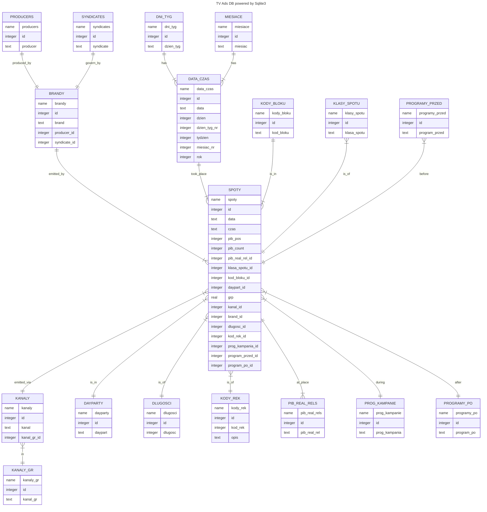
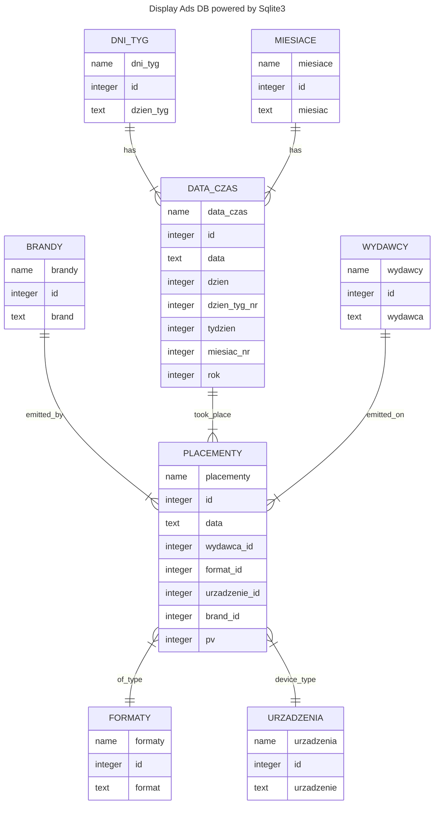

___
# Design Document

By Marcin Borowski

GitHub repo: [repository](https://github.com/MrSz-84/ads_db_project)

 

## Scope

This project was designed and executed to serve few purposes:

1. As a learning process of databases data manipulation and communication with database via python api.
2. A place to store data about radio, television and display advertisements emitted by companies on AGD RTV market retail in Poland.
3. As fast and reliable place to write to and read from for reporting purposes. Storing this data in Excel files is deeming, slow and prone to data loss.
4. As learning experience for Pandas package usage, ways of data manipulation and aggregation.
5. A way of automating tedious and repetitive work.

This project consists of 3 different databases based on Sqlite3 engine and syntax, in tandem with sqlite3 module build in Python itself. 
Unfortunately the DBAPI is quite a few updates behind the DB engine, thus I was unable tu utilize all of its new features.

1. Radio ads database:
   * The database is storing data gathered by the company conducting market surveys of television advertisement (Kantar Media).
   * There are few main companies which own radio stations of various reach across Poland, and each radio station can broadcast radio ads.
   * It *includes*, radio brand owners, radio brands, radio stations, brands instructing ads broadcasting, exact days, hours, dayparts, lengths, and simple transcriptions of ad contents.
   * Contents of those ads also *includes* other brands and manufacturers of commodities.
2. TV ads database:
   * The database is storing data gathered by the company conducting market surveys of radio advertisement (Nielsen).
   * There are few main companies which own tv stations of nationwide reach across Poland, and each tv owner can broadcast tv ads on multiple television channels.
   * It *includes*, tv channels and channel groups, brands instructing ads broadcasting, exact days, hours, dayparts, lengths, and simple transcriptions of ad contents.
   * Contents of those ads also *includes* other brands and manufacturers of commodities.
3. Display ads on main www sites in Poland.
   * The database is storing data gathered by hand surveying during daily checks.
   * It contains only display online ads, capped or bought in FF mode.
   * All CPM campaigns, GAds, RTB and similar advertisements are excluded from this dataset.
   * Data indicates the site on which ad was placed, date, name of the ad slot, who instructed the ad and avg. ad impressions.

 

> **NOTE**
>
> Code used in creation of functions and triggers is written using SQL and Sqlite 3 syntax, so it may have some quirks. Please keep this in mind.

 

## Functional Requirements

The database is going to help with:

* Storing the data of radio, tv and display ads for given branch of Polish retail market.
* Providing updates of the data in continuous manner. Reporting is conducted usually in daily manner.
* Enabling data edition and correction using SQL syntax and the benefits of transactions.
* Creation of reports, tables, charts, analysis etc.
* Reading the data to other environments such as Power BI, Pandas, Matplotlib, or simply providing tables in pure SQL queries.
* Conducting various data read and write duration tests.
* Reduction of disk space needed to store data in Excel files. Microsoft's Excel team knows how to compress the data, but good data model can save a lat of space!

## Representation
The data is being transferred into SQL tables as mentioned below. I used snowflake type data models in tv and radio ads, and star type data model in display ads DB. 
The fact tables are named spoty in both, the tv and radio advertisements DB, and placementy in display ads DB. Rest of the tables are considered as dimension ones.

### Entities

#### <u>Radio ads database fact table `spoty`</u>

The `spoty` table contains the data about the advertisement emission, their contents, type, code, 
who instructed the broadcast, where it was broadcast, ad emission time details, costs etc. 
The smallest unit of this table is one emission. Each row must have entries in all columns 
except one (`koszt`), therefor `NOT NULL` constraints were added. Columns included in this table are:

- `id` which is the unique identification number of each ad emission, and by so has `PRIMARY KEY` 
constraint applied.
- `data` which states when given emission took place. Date is in ISO 8601 format. In addition, 
this is the column which relates to `data_czas` table, thus `FOREIGN KEY` constraints were applied.
- `gg` which is the hour at which the emission took place. `INTEGER` data type was used here.
- `mm` which is the minute ow an hour at which the emission took place. `INTEGER` data type was used
here.
- `ss` which is the second ow a minute at which the emission took place. `INTEGER` data type was used
here.
- `koszt` which represents the rate card cost of single emission. Best fit for rate card costs, 
being whole numbers is `INTEGER` type. This field can be empty, so no constraints was added.
- `dlugosc` is the actual duration time of a single spot emission. 
- `kod_rek_id` which should be a unique numeric value of given advertisement. 
The type `INTEGER` was used here, cuz this field represents a `FOREIGN KEY` to a dimension table 
containing actual code value. 

    > **NOTE!**
    > 
    > ADVERTISEMENT != EMISSION 
    > 
    > The same advertisement can be emitted several times.

- `daypart_id` which is a unique number that can be bound with the information about which daypart 
this spot was emitted. Daypart is an arbitrary value addressing company reporting needs.
- `dl_ujednolicona_id` which is a unique number that can be bound to a dimension table representing
unified lengths of distinct ad spot. Those lengths being (in seconds): 10, 15, 20, 30, 45, 60.
- `blok_rek_id` this is a range of 30 minutes in which advertising spots must be emitted. 
A brand instructing emission can choose how many and in which slot ads must appear. 
This is represented as text in GG:MM-GG:MM format, where the first part MM must be either 00 or 30, 
and the second 29 or 59 respectively. This field is a foreign key for the actual string representation 
of the time block, thus  `INTEGER` was used here as a data type, and `FOREIGN KEY` restrictions were added.
- `brand_id` which contains unique number that can be bound with brand instructing the emission 
(ad owner) table. Type used `INTEGER`, and `FOREIGN KEY` restrictions were added.
- `submedium_id` which contains unique number that can be bound with the owner od radio group 
- or single radio station gathered in another table. Type used `INTEGER`, and `FOREIGN KEY` 
restrictions were added.
- `typ_produktu_id` which contains unique number that can be bound with typu_produktow table. 
Thus type `INTEGER` was used and `FOREIGN KEY` constraints applied.
- `l_emisji` is a number of ad emission. This value can't be a negative number, so `CHECK` was added,
and `INTEGER` type used.
- `typ_rek_id` which holds type of add, thus `TEXT` was used as a type, and a `DEFAULT` value set in
case of missing data.

#### <u>TV ads database fact table `spoty`</u>

The `spoty` table contains the data about the advertisement emission, their contents, type, code, 
who instructed the broadcast, where it was broadcast, ad emission time details, costs etc. 
The smallest unit of this table is one emission. Each row must have entries in all columns 
except three (`prog_kampania_id`, `program_przed_id`, `program_po_id`), therefor `NOT NULL` 
constraints were added. Columns included in this table are:

- `id` which is the unique identification number of each ad emission, and by so has `PRIMARY KEY` 
constraint applied.
- `data` which states when given emission took place. Date is in ISO 8601 format. In addition, 
this is the column which relates to `data_czas` table, thus `FOREIGN KEY` constraints were applied.
- `czas` which is the time of emission in ISO format HH:MM:SS, here represented as `TEXT` data type.
- `pib_pos` which represents the numeric position in ad block. Thus `INTEGER` type was used.
- `pib_count` which represents the count of all ad emissions in given ad block. Therefore `INTEGER`
data type was used.
- `pib_real_rel_id` which is a unique numeric representation of a real relative ad in given block.
It can, for instance, take values as *first*, *last*, *second last*, etc.
- `klasa_spotu_id` which is a unique number that can be bound with the information about the type of
every spot sored in dimension table. Here `INTEGER` data type was used.
- `kod_bloku_id` which is a unique number that can be bound with the information about the code of ad
block in which given ad was emitted. Actual  data can be found in dimension table, 
here `FOREIGN KEY` of `INTEGER` data type was used.
- `daypart_id` which is a unique number that can be bound with the information about which daypart 
this spot was emitted. Here, contrary to radio_ads DB, the daypart is an industry standard represented as 
*prime* and *off*. Those are best broadcast times, and those less lucrative in audience. 
- `grp` being the number of gross rating points of particular ad emission. It is a floating point number
therefore `REAL` data type was used.
- `kanal_id` which is a unique number that can be bound with the information about on what channel ad
was emitted. That dimension table contains of chanel name and chanel group that consolidates numerous channels.
- `brand_id` which contains unique number that can be bound with brand instructing the emission 
(ad owner) table. Type used `INTEGER`, and `FOREIGN KEY` restrictions were added.
- `dlugosc_id` which is a unique number that can be bound to a dimension table representing
unified lengths of distinct ad spot. Contrary to radio_ads DB, here industry standards are forced.
- `kod_rek_id` which should be a unique numeric value of given advertisement. 
The type `INTEGER` was used here, cuz this field represents a `FOREIGN KEY` to a dimension table 
containing actual code value. 

    > **NOTE!**
    > 
    > ADVERTISEMENT != EMISSION
    > 
    > The same advertisement can be emitted several times.

- `prog_kampania_id` which is a unique number that can be bound to a dimension table representing
during what tv program given spot was emitted, hence `FOREIGN KEY` as `INTEGER` data type was used here.
- `program_przed_id` which is a unique number that can be bound to a dimension table representing
before what tv program given spot was emitted, hence `FOREIGN KEY` as `INTEGER` data type was used here.
- `program_po_id` which is a unique number that can be bound to a dimension table representing
after what tv program given spot was emitted, hence `FOREIGN KEY` as `INTEGER` data type was used here.

#### <u>Display ads database fact table `placementy`</u>

The `placementy` table contains the data about the advertisement emission, where were they emitted,
at what online placement the ad was seen, when it was emitted, who instructed the broadcast, 
the number of ad impressions etc. 
This is the smallest of all databases in this project, yet the data is sufficient for reporting 
purposes and analysis. All columns need to be filled with data. Columns included in this table are:

- `id` which is the unique identification number of each ad emission, and by so has `PRIMARY KEY` 
constraint applied.
- `data` which states when given emission took place. Date is in ISO 8601 format. In addition, 
this is the column which relates to `data_czas` table, thus `FOREIGN KEY` constraints were applied.
- `wydawca_id` which contains unique number that can be bound with the www site owner, on which 
given ad was emitted.
- `format_id` which contains unique number that can be bound with the format name, which was used for
given ad emission.
- `urzadzenie_id` which contains unique number that can be bound with the type of device, on which
ad could be seen. Those would be desktop, mobile and cross device.
- `brand_id` which contains unique number that can be bound with brand instructing the emission 
(ad owner) table. Type used `INTEGER`, and `FOREIGN KEY` restrictions were added.
- `pv` the number of impression made by given ad emission. These values are estimated based on own 
emissions, and broadcaster data

### Relationships

In the ER diagram below User can find the relationships between tables, as well the identification 
of each used column and its type. Mermaid for VSC was used for creation. See **[Marmaid](https://mermaid.js.org/)** 
website for more information.

 
 

#### **ER DIAGRAM -> RADIO ADS DB**

  

#### **ER DIAGRAM -> TV ADS DB**

  

#### **ER DIAGRAM -> DISPLAY ADS DB**
